#### UNIVERSIDAD DE SAN CARLOS DE GUATEMALA
#### FACULTAD DE INGENIERÍA
#### ESCUELA DE CIENCIAS Y SISTEMAS
#### LENGUAJES FORMALES Y DE PROGRAMACION B+
#### ING. DAVID MORALES
#### AUX. FRANCISCO MAGDIEL ASICONA MATEO
#
#
#

### 
PROYECTO NO. 1 : MANUAL TÉCNICO
 
#
#
#
#### 
JAIRO ADELSO GOMEZ HERNANDEZ
 
#### 
CARNE : 201902672
 
#### 
2993206770101
 
#### 
SECCION B+
 
#### 
24 DE SEPTIEMBRE DE 2023
 

-----
#### *Requerimientos*
##### - Sistema Operativo Windows
•	Procesador: de 1 gigahercio (GHz), o procesador o SoC más rápido
•	RAM: 1 gigabyte (GB) para 32 bits o 2 GB para 64 bit
•	Espacio en disco duro:16 GB para el sistema operativo de 32 bits o
•	20 GB para el sistema operativo de 64 bits
•	Tarjeta gráfica: DirectX 9 o posterior con controlador WDDM 1.0
•	Pantalla: 800 x 600

##### - Python 3.11.4
•	Sistema Operativo: Windows 10 (8u51 y superiores)
•	RAM: 128 MB
•	Espacio en disco: 1 GB 
•	Procesador: Mínimo Pentium 2 a 266 MHz

##### - Visual Studio Code
•	Sistema Operativo: Windows 10 (8u51 y superiores)
•	RAM: 1 GB RAM
•	Espacio en disco: 200 MB 
•	Procesador: Mínimo Procesador 1.6 GHz o superior

------

#### main .py
##### Clase app:

######  __init __

En el metodo __init __ aca se creara la ventana, los botones, el area de texto y sus funcionalidades para que la interfaz grafica. Definiendo asi como el tamaño de la ventana y la funcionalidad de cada boton.

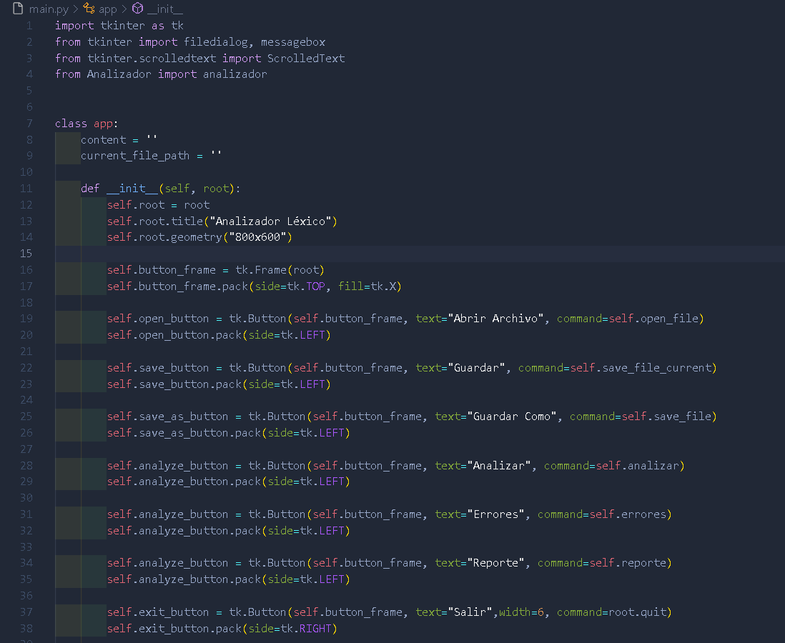

##### open_file

En el metodo _open_file_, se crea la funcionalidad en el cual abriremos una ventana emergente.
~~~
file_path = filedialog.askopenfilename(filetypes=[("Archivos con Formato JSON", "*.json")])
        if file_path:
            self.current_file_path = file_path
            with open(file_path, 'r') as file:
                self.content = file.read()
                self.text_widget.delete(1.0, tk.END)
                self.text_widget.insert(tk.END, self.content)
            self.update_line_numbers()
~~~
En el cual pediremos que seleccione un archivo con formato json, y lo guardaremos en _file_path_ y recibiremos el contenido para asi ser guardado y mostrado en el area de texto creada.

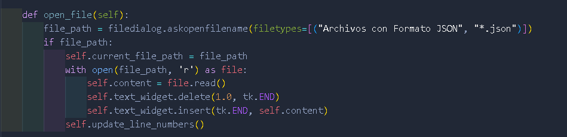

##### save_file_current

En el metodo _save_file_current_ creamos la funcionalidad de guardar sobre el mismo archivo que abrimos en el metodo _open_file_

~~~
    if self.current_file_path:
        self.content = self.text_widget.get(1.0, tk.END)
        with open(self.current_file_path, 'w') as file:
            file.write(self.content)
        messagebox.showinfo("Guardado", "Archivo guardado exitosamente.")
    else:
        messagebox.showerror("Error", "No se ha abierto ningún archivo para guardar.")
~~~

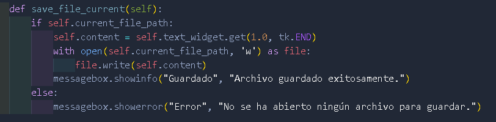

##### save_file

~~~
file_path = filedialog.asksaveasfilename(defaultextension=".json", filetypes=[("Archivos de con Formato JSON", "*.json")])
        if file_path:
            self.content = self.text_widget.get(1.0, tk.END)
            with open(file_path, 'w') as file:
                file.write(self.content)
            messagebox.showinfo("Guardado", "Archivo guardado exitosamente.")
~~~

En este metodo _save_file_ creamos la funcionalidad guardar como, en la cual guardaremos el contenido de la area de texto, pidiendo asi la direccion de donde queremos guardar el archivo, asi como en un archivo ya creado previamente.

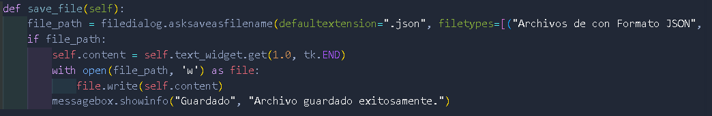

##### analizar

En este metodo analizar, se importa la funcionalidad de analizar, el cual lo importamos desde el archivo "_Analizador .py_" y muestre asi los resultados de las operaciones recibidas en el archivo de entrada.

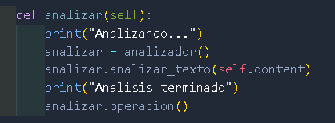

##### errores

En este metodo errores, se importa la funcionalidad para el boton errores, el cual importamos desde el archivo "_Analizador .py_" y muestra asi un mensaje de confirmacion que se ha creado el reporte.

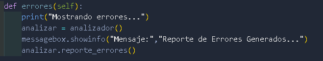

##### reporte

En este metodo reporte, se importara la funcionalidad para el boton reporte, el cual importamos desde el archivo "_Analizador .py_" y muestra asi un mensaje de confirmacion y crea la reporte grafico.

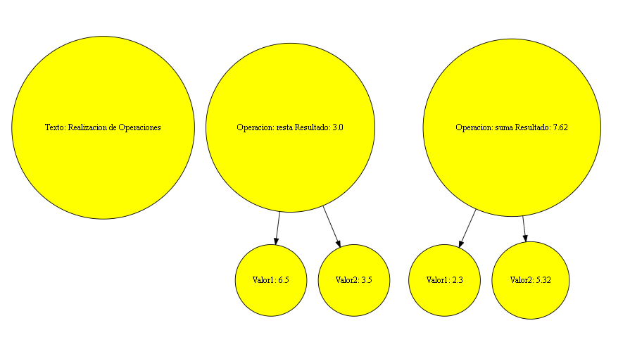

#### Analizador .py
##### Clase analizador:

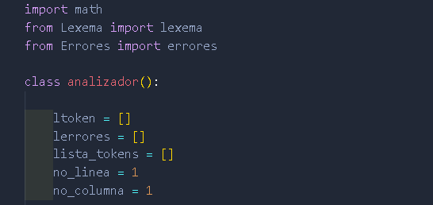

En esta clase se creara la funcionalidad como tanto como "analizar_texto" , "armar_lexema", "armar_numero" , "operar" , "operacion" , "reporte_reportes" la cual declaramos las listas en las cuales guardaremos la lista de tokens, lista de errores y lista de tokens que se usara para guardar los valores que luego seran operados.

##### analizar_texto

En este metodo recorreremos el _texto_ lo cual sera asignandole un indice, eh iremos recorriendo caracter para ir reconociendo y asignandolo a su lista correspondiente con sus parametros creados previamente en las clases como _lexema_ , _errores_
tambien para encontrar numeros y mandarlos al metodo _armar_numero_ y _armar_lexema_ 
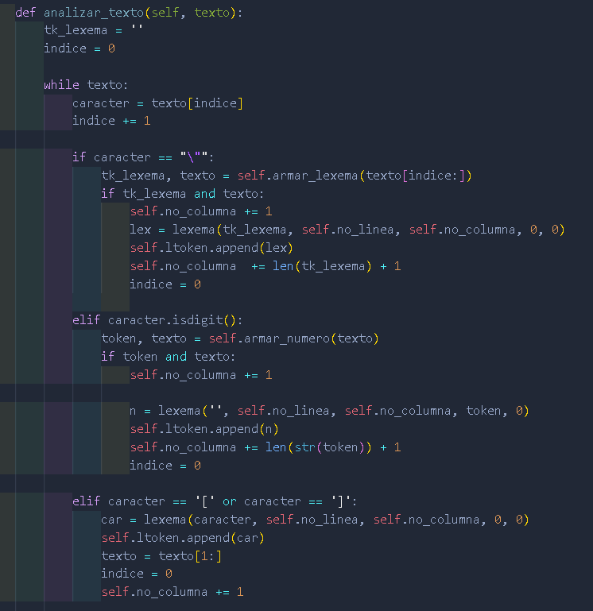

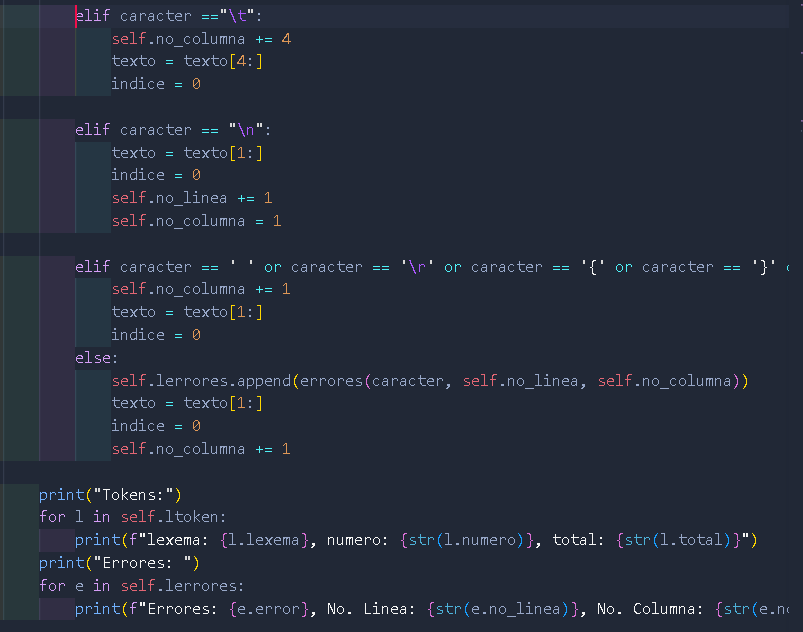

Esto para armar nuestras listas, y asi hacer las operaciones y reportes.

##### armar_lexema

En este metodo recorremos el texto, para armar nuestro lexema, separandolo en cada caracter analizado.
~~~
for caracter in texto:
            indice += caracter
            if caracter == '\"':
                return tk_lexema, texto[len(indice):] 
            else:
                tk_lexema += caracter
~~~

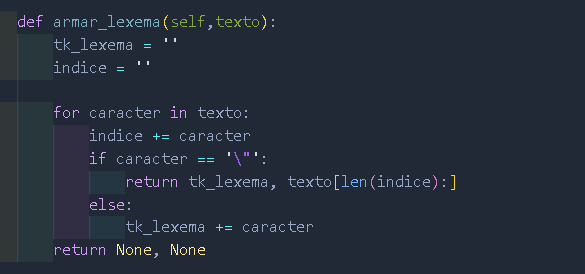

##### armar_numero

En este metodo recorremos el texto, para armar nuestros numeros, separandolo en cada caracter analizados.

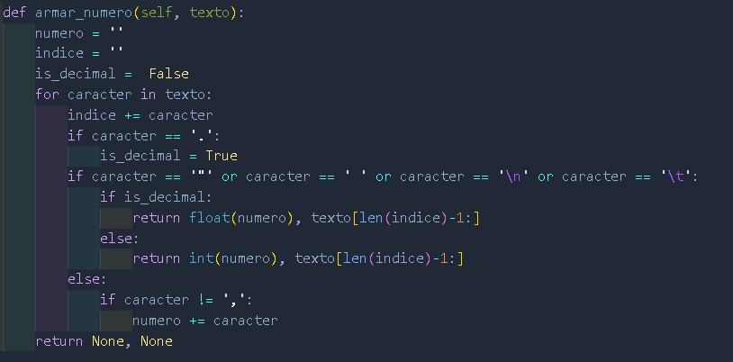

#### operar

En este metodo con el cual se llamara para que realice las operaciones, parasando por parametros la operacion deseada, el valor1 y el valor2.
Se valida que operacion sea igual a alguna de las operaciones creadas y si es asi, operar los valores y asi retornar el resultado.
En caso no encontrar algun valor o operacion nos imprimira un _none_

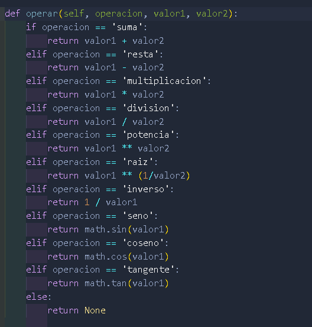

#### operacion

En este metodo tendremos nuetra lista_tokens la cual recorreremos y extrayendo los datos de nuestra lista. Se recorre la lista buscando que sea igual a _operacion_ si se cumple, lo guardamos y extraemos el la operacion. luego verificamos el _valor1_ que si este cumple extraemos el valor1 y tambien se verifica si no viene un corchete _[_ si es asi se operara el interior.
Al igual se verificamos el _valor2_ que si este cumple extraemos el valor2 y tambien se verifica sino viene un corchete _[_ si es asi se operara el interior. 
Se verifica si operaciones y el n1 y n2, si este es verdadero, se realiza la operacion y se imprime el resultado.
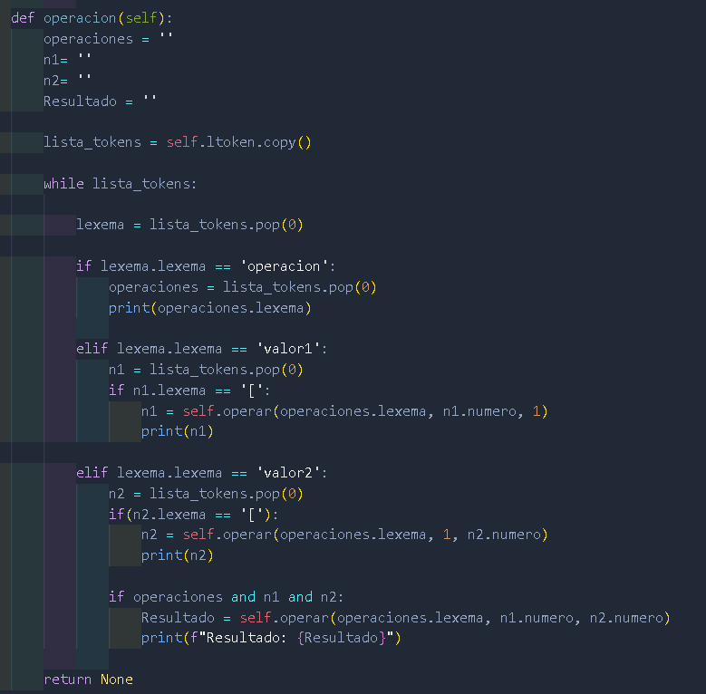

#### reporte_errores

En este metodo se usa la lista_error, la cual es una copia de mi lerrores, y creo un cont el cual contiene las llave _[ ]_ el cual recibira la lista de errrores.

Luego se recorre la lista_errores, se extraera los errores, el no. fila y el no. columna y y se arrega al arreglo.
Se genera el _cont_json_ se ingresa el contenido y se recorre el arreglo _cont_error_  para ir ingresando los errores, el no. descripcion, el tipo, columna, y fila, para luego escribir el contenido en el archivo json con _REPORTE_201902672.json_ con un mensaje de reporte generado correctamente. 
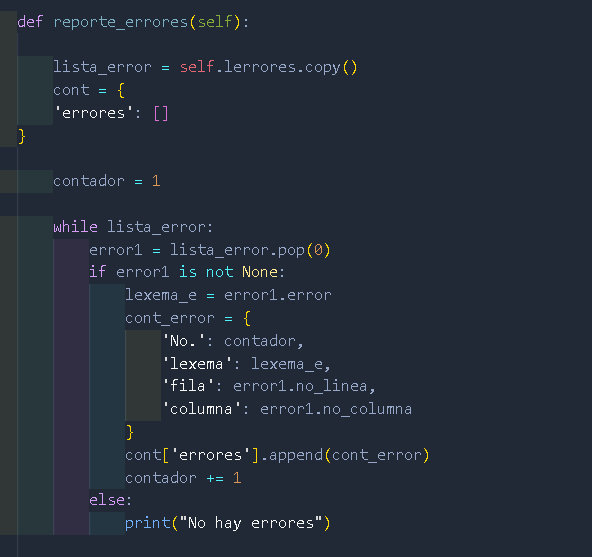
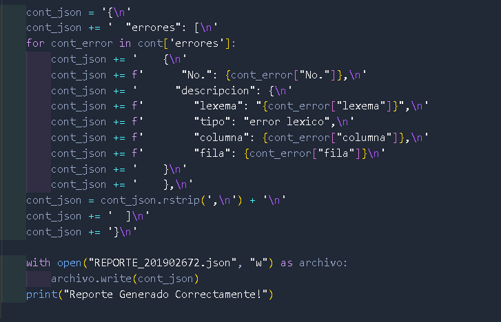

##### Graficar
En el metodo este metodo se genera el contenido y la grafica de la libreria _"Graphviz"_ en la cual recibira el contenido del metodo "to_dot" el cual se encarga de agregar las caracteristicas de la graficas.
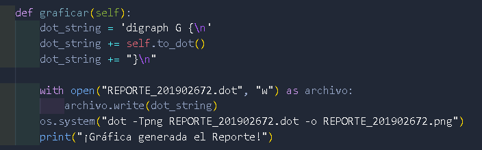

##### to_dot
En este metodo to_dot se crean los nodos que llevaran las configuraciones leidas en el archivo de entrada, como lo es "texto", "fondo", "fuente", "forma", como los resultados de nuestras operaciones.
se crearan los nodos "resultado" que se enlaza al valor1 y valor2, para asi mostrar el reporte.
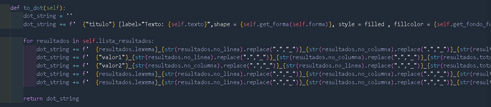

#### get_fondo_fuente
En este metodo se hace validaciones de si el color recibido en configuracion es valido nos retornara el color para la configuracion en el _metodo_to_dot_ pasandole por parametros el valor de la variable que se guarda al momento de operar.

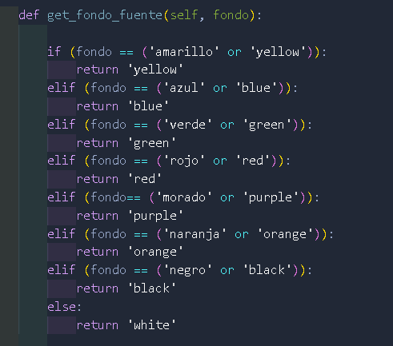

#### get_forma
En este metodo se hacen las validaciones de si la forma recibida en la configuracion es valido nos retornara asi la forma, para la configuracion en el _metodo_to_dot_ pasandole por parametros el valor de la variable que se guarda al momento de operar.

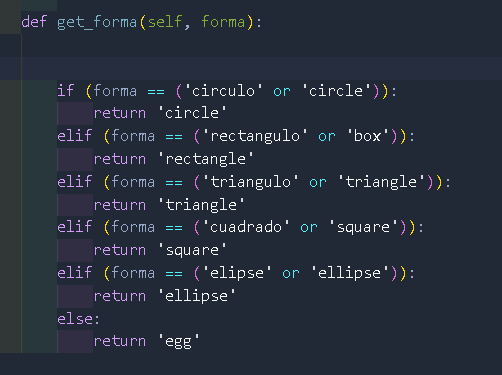

#### Lexema .py
##### Clase lexema
######  __init __

Se crea un el constructor con los atributos tales como _lexema_ , _no_linea_ , _no_columna_, _numero_ , _total_ usados en el _analizar_texto_ 
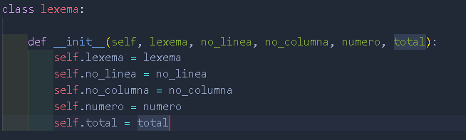

#### Errores .py
##### Clase errores
######  __init __

Se crea un el constructor con los atributos tales como _errores_ , _no. linea_ , _no. columna_ usados en el _analizar_texto_ 
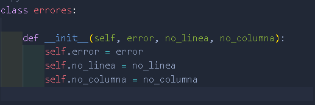
