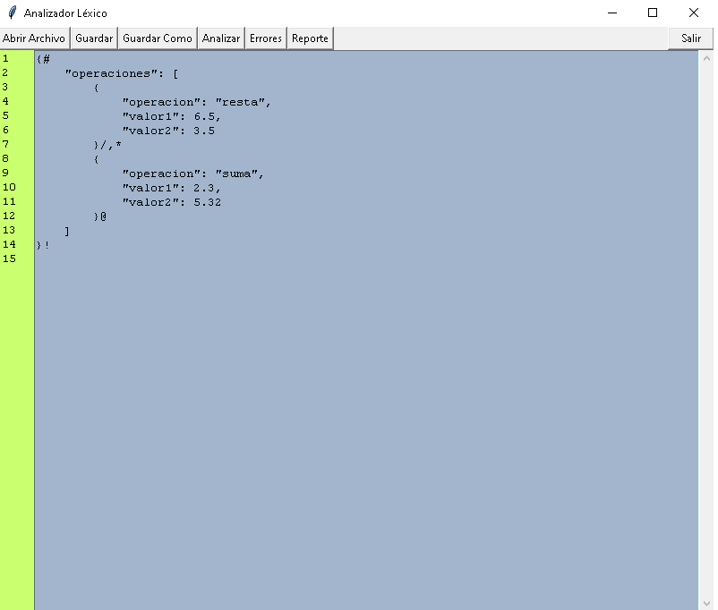
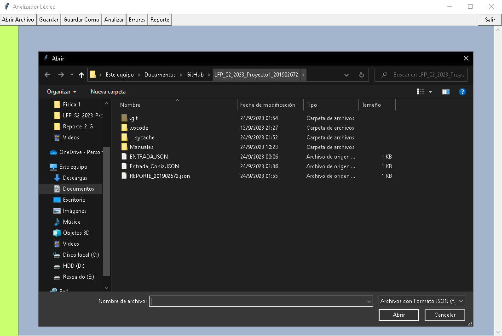
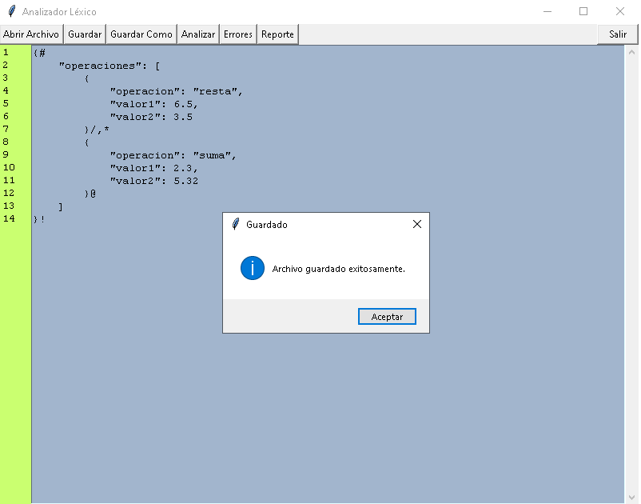
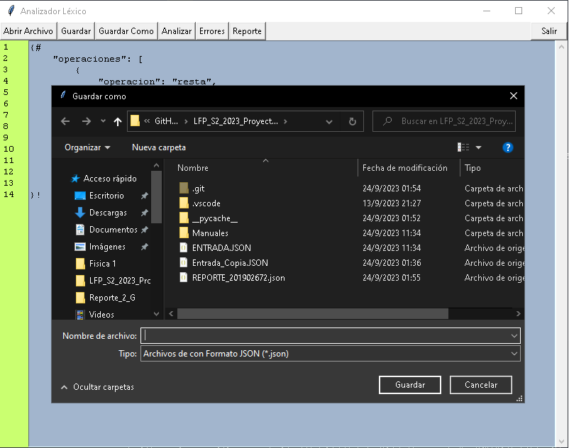
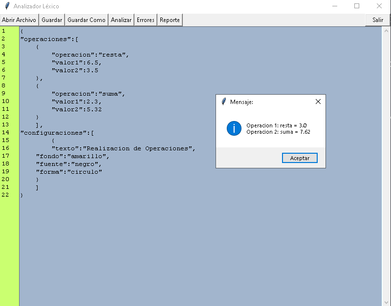
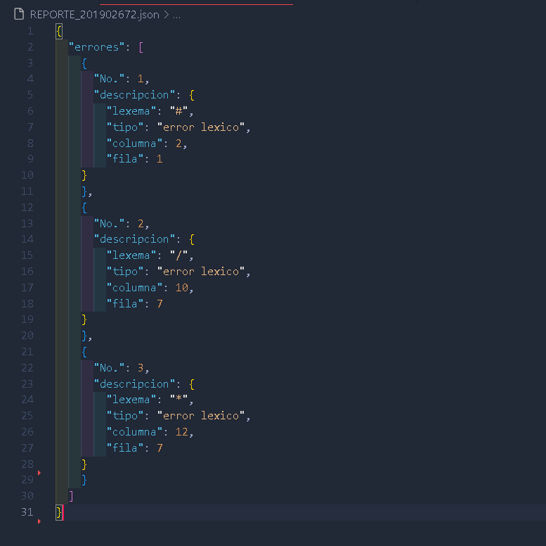
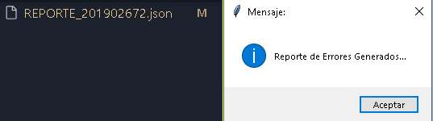
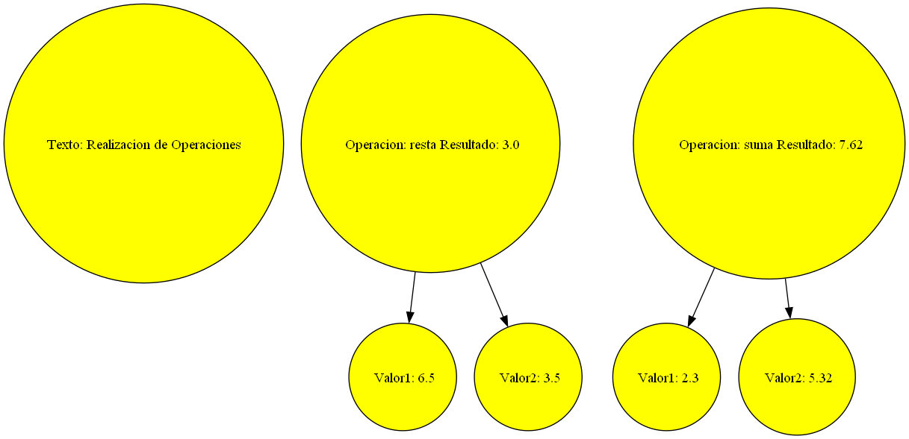

#### UNIVERSIDAD DE SAN CARLOS DE GUATEMALA
#### FACULTAD DE INGENIERÍA
#### ESCUELA DE CIENCIAS Y SISTEMAS
#### LENGUAJES FORMALES Y DE PROGRAMACION B+
#### ING. DAVID MORALES
#### AUX. FRANCISCO MAGDIEL ASICONA MATEO
#
#
#

### 
Proyecto No. 1 : Manual de Usuario
 

#
#
#
#### 
JAIRO ADELSO GOMEZ HERNANDEZ
 
#### 
CARNE : 201902672
 
#### 
2993206770101
 
#### 
SECCION B+
 
#### 
24 de Septiembre de 2023
 

-----

### 
_Introduccion_ 

 En esta aplicación a continuación tiene la funcionalidad de recrear una interfaz gráfica inteligente diseñada para simplificar y potenciar la manipulación de archivos en formato JSON. Su enfoque principal radica en la ejecución de análisis léxicos precisos, la realización de operaciones personalizadas definidas en el archivo y la generación de informes detallados que permiten identificar y corregir errores en los datos. Pero eso no es todo, ya que esta aplicación va un paso más allá al permitir la representación gráfica de los resultados mediante la herramienta Graphviz. Nuestra aplicación será capaz de analizar e ir almacenando carácter por carácter nuestro archivo de entrada, para así ir armando nuestra lista de lexemas y lista de errores, una vez llena las listas se recorrerán para ir verificando los operadores e ir realizando las operación básicas como suma, resta, multiplicación, y división de valores individuales y operaciones con valores anidados.

____

### _Inicio de la Aplicación_

#### *Interfaz Grafica*

Esta interfaz grafica sera el inicio de nuestra aplicacion, en la cual tendremos las opciones "Abrir Archivo", "Guardar", "Guardar Como", "Analizar", "Errores" y "Reporte" junto a un boton "Salir" y una area de texto en la cual se mostrara el archivo de entrada, y se le podra hacer modificaciones.

#### *Abrir*

Al presionar el boton abrir, se nos abrira una ventana en la cual deberemos seleccionar el archivo con formato json que deseamos analizar y que se pueda visualizar en el area de texto.

#### *Guardar*

Al presionar el boton guardar, guardara los cambios hechos previamente en el area de texto, y se guardaran en el mismo archivo. Mostrando un mensaje de que se ha guardado con exito.

#### *Guardar Como*

Al presionar el boton guardar como, se nos abrira una ventana en la cual podemos guardar los cambios en un archivo nuevo o en otro previamente creado. Mostrando un mensaje de que se ha creado con exito.

#### *Analizar*

Al presionar el boton Analizar, se analizara lexicamente el archivo de entrada, y realizando las operaciones que esten en el archivo de entrada y mostrando un mensaje con el resultado de las operaciones.

#### *Errores*

Al presionar el boton "Errores" se generara un archivo json con el nombre "REPORTE_201902672.json" en el cual se mostrara los errores, con el No. de error, el error de lexema y la fila y columna en la que se encontro el error.

##### *Confirmacion del Reporte de Errores Creado!*

#### *Reporte*

Al presionar el boton "Reporte" se generara un reporte grafico en formato REPORTE.png en el cual se mostrara graficamente el resultado de las operaciones realizadas al analizar el archivo de entrada. 

----

